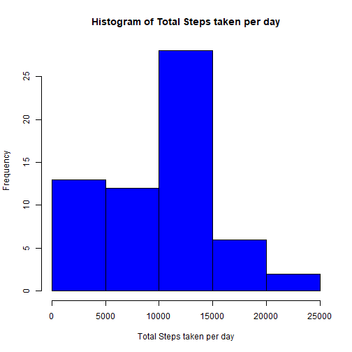
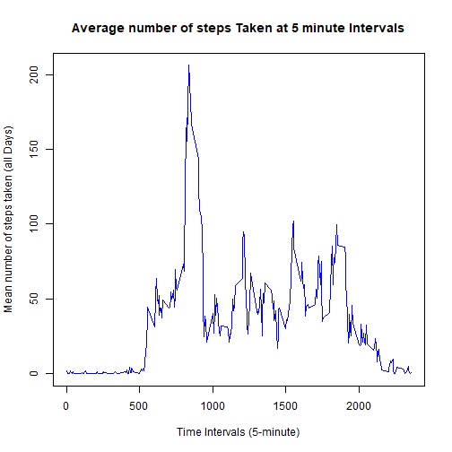
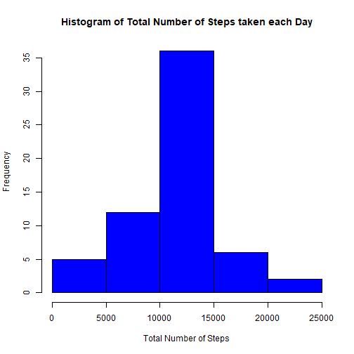
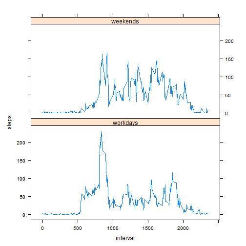

$("#content").html(function(){
    return marked(markdownString,{ renderer: renderer });
});
//my code
    var  temppath=dirurl.split('/');
    temppath.pop();
    var  basepath=temppath.join('/');
    $("img").each(function(index,item){item.src=item.src.replace(location.pathname,location.pathname+basepath+"/")
    });
//end of my code                        
    $('#toc').toc();

## Background
It is now possible to collect a large amount of data about personal movement using activity monitoring devices such as a Fitbit, Nike Fuelband, or Jawbone Up. These type of devices are part of the “quantified self” movement – a group of enthusiasts who take measurements about themselves regularly to improve their health, to find patterns in their behavior, or because they are tech geeks. But these data remain under-utilized both because the raw data are hard to obtain and there is a lack of statistical methods and software for processing and interpreting the data.

This assignment makes use of data from a personal activity monitoring device. This device collects data at 5 minute intervals through out the day. The data consists of two months of data from an anonymous individual collected during the months of October and November, 2012 and include the number of steps taken in 5 minute intervals each day.


## Loading and preprocessing the data


```r
fileurl<-"https://d396qusza40orc.cloudfront.net/repdata%2Fdata%2Factivity.zip"
if (!file.exists(("data"))) {dir.create("./data")}
download.file(fileurl, destfile="./data/repdata%2Fdata%2Factivity.zip")
unzip("./data/repdata%2Fdata%2Factivity.zip", exdir="./data")
rawdata<-read.csv("./data/activity.csv", na.strings = "NA")
```

## What is mean total number of steps taken per day?

### Make a histogram of the total number of steps taken each day


```r
totalstep<-tapply(rawdata$steps, rawdata$date, sum, na.rm=T)
hist(totalstep,col="blue",main="Histogram of Total Steps taken per day",
     xlab="Total Steps taken per day",cex.axis=1,cex.lab = 1)
```



### Calculate and report the mean and median total number of steps taken per day


```r
totalmean<-mean(totalstep)
totalmedian<-median(totalstep)
```
- The mean total number of steps taken per day is 9354.2295082 steps.
- The median total number of steps taken per day is 10395 steps

## What is the average daily activity pattern?

### Make a time series plot (i.e. \color{red}{\verb|type = "l"|}type="l") of the 5-minute interval (x-axis) and the average number of steps taken, averaged across all days (y-axis)


```r
steps_interval <- aggregate(steps ~ interval, 
                                data = rawdata, 
                                mean, na.rm = TRUE)
plot(steps ~ interval, data = steps_interval, type = "l", 
     xlab = "Time Intervals (5-minute)", 
     ylab = "Mean number of steps taken (all Days)", 
     main = "Average number of steps Taken at 5 minute Intervals",  
     col = "blue")
```




### Which 5-minute interval, on average across all the days in the dataset, contains the maximum number of steps?


```r
maxStepInterval <- steps_interval[which.max(steps_interval$steps),"interval"]
```
- The 835th interval contains the maximum number of steps

## Imputing missing values
### Calculate and report the total number of missing values in the dataset (i.e. the total number of rows with NAs)


```r
missing_rows <- sum(!complete.cases(rawdata))
```
- The total number of missing rows is 2304.

### Devise a strategy for filling in all of the missing values in the dataset.


```r
## This function returns the mean steps for a given interval
intervalmean <- function(interval) {
  steps_interval[steps_interval$interval==interval,"steps"]
}
```

### Create a new dataset that is equal to the original dataset but with the missing data filled in.

```r
modidata <- rawdata
flag = 0
for (i in 1:nrow(modidata)) {
  if (is.na(modidata[i, "steps"])) {
    modidata[i, "steps"] <- intervalmean(modidata[i, "interval"])
    flag = flag +1
  }
}
```

### Make a histogram of the total number of steps taken each day.


```r
newtotalsteps <- aggregate(steps ~ date, data=modidata, sum)
hist(newtotalsteps$steps, col = "blue", xlab = "Total Number of Steps", 
     ylab = "Frequency", main = "Histogram of Total Number of Steps taken each Day")
```


### Calculate and report the mean and median total number of steps taken per day.

```r
newmean <- mean(newtotalsteps$steps)
newmedian <- median(newtotalsteps$steps)
```
- The mean total number of steps taken per day is 1.0766189 &times; 10<sup>4</sup>
- The median total number of steps taken per day is 1.0766189 &times; 10<sup>4</sup>

### Do these values differ from the estimates from the first part of the assignment? 

- Both the mean and the median are different.

### What is the impact of imputing missing data on the estimates of the total daily number of steps?

- The mean changes because the missing values were not taken in to account and thus the count changes

- The median value is different, since the median index is now being changed after imputing missing values.

## Are there differences in activity patterns between weekdays and weekends?

### Create a new factor variable in the dataset with two levels – “workdays” and “weekends” indicating whether a given date is a weekday or weekend day.


```r
library(forcats)
modidata$weekday <- as.factor(weekdays(as.POSIXct(modidata$date)))
modidata$weekday <- fct_collapse(modidata$weekday, 
                    "workdays" = c("Monday", "Tuesday", "Wednesday", "Thursday", "Friday"), 
                    "weekends" = c("Saturday", "Sunday"))
```

### Make a panel plot containing a time series plot (i.e. \color{red}{\verb|type = "l"|}type="l") of the 5-minute interval (x-axis) and the average number of steps taken, averaged across all weekday days or weekend days (y-axis).


```r
library(lattice)
newsteps_interval <- aggregate(steps ~ interval + weekday, data=modidata, mean)
xyplot(steps ~ interval | factor(weekday), data = newsteps_interval, aspect = 1/2, 
       type = "l")
```


